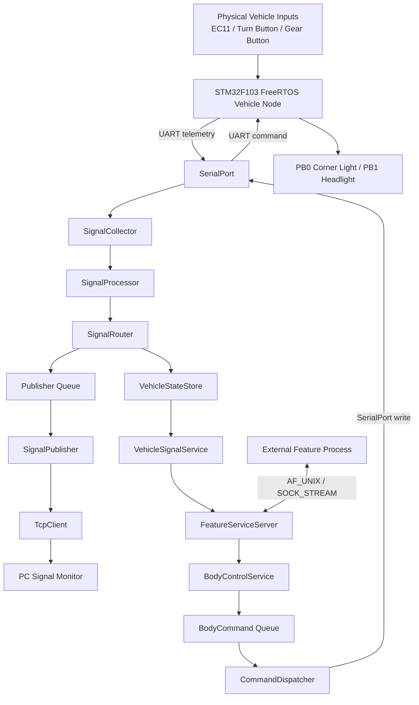
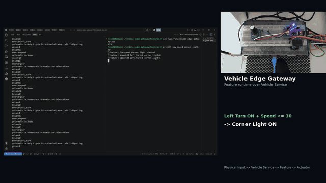
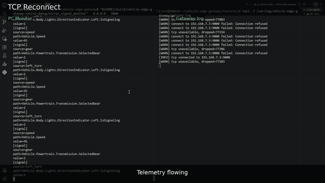
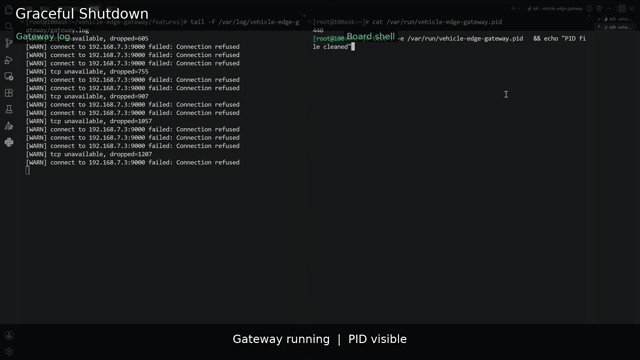

# Vehicle Edge Gateway

基于 **i.MX6ULL + STM32F103C8T6** 的 Embedded Linux / FreeRTOS 车端信号集成、服务化与动态功能原型。

> 正式源代码维护在私有仓库中。  
> 本仓库用于展示项目架构、关键设计、验证结果与 Demo，不包含正式源码、目标板二进制或私有 Git 历史。

**Tech Stack:** C++17 · C · Embedded Linux · FreeRTOS · STM32F103 · i.MX6ULL · UART · Multithreading · epoll · TCP · Unix Domain Socket · CMake

---

## 项目简介

项目由四个连续阶段组成：

1. **Linux Gateway V1** — UART signal acquisition → parse / mapping → TCP publishing；
2. **STM32 + FreeRTOS Vehicle Node** — Task / Queue / ISR 架构、双向 UART 与 MCU actuator；
3. **Signal-to-Service + Dynamic Feature MVP** — Vehicle State、Service API、semantic command、same-process UART full duplex 与可替换外部 Feature；
4. **Hardware-Driven Vehicle Input Demo** — EC11 + 物理按键替换自动模拟信号，完成 physical input → Vehicle Service → Dynamic Feature → actuator 的实机链路。

项目目标是用有限硬件实践现代 SDV / Vehicle Integration Platform 中的分层思想。

---

## 当前完整架构



STM32 侧运行 `AcquisitionTask / CommunicationTask / UartRxTask / ControlTask`，负责 physical input sampling、telemetry、UART RX handoff、command parsing 与 actuator execution。

---

## Hardware-Driven Vehicle Inputs

最终 Demo 使用真实物理输入：

```text
EC11 encoder
→ speed 0..120
→ step 5 / detent

Left-turn button
→ left_turn 0 / 1

Gear button
→ Forward +1 / Reverse -1
```

STM32 以 5 ms 周期采样输入、约 30 ms button debounce，并以 100 ms 周期发布当前 vehicle state。

---

## Key Capabilities

- STM32F103 + FreeRTOS physical vehicle-input acquisition and actuator execution
- Bidirectional UART between STM32 and i.MX6ULL within the same Gateway runtime
- VSS-like semantic mapping, latest Vehicle State and typed service APIs
- External Dynamic Feature process through Unix Domain Socket
- Runtime Feature replacement without rebuilding the Gateway or reflashing STM32
- TCP heartbeat / automatic reconnect and graceful shutdown

---

## Derived Vehicle Feature

Feature A 使用多个车辆状态推导新的 vehicle behavior：

```text
Left-turn request
+
Vehicle speed
↓
Low-Speed Cornering Light Feature
↓
Corner Light actuator
```

Feature 通过 Vehicle Service 读取状态并通过 semantic control service 请求 actuator，不直接访问 UART、GPIO、HAL 或 FreeRTOS internals。

Feature B 使用简单的 speed threshold 控制 Headlight，用于展示 runtime replacement。

---

## SOA / SDV-like 体现

```text
Hardware / Transport
        ↓
Vehicle State / Vehicle Service
        ↓
Independent Feature
        ↓
Semantic Control Service
        ↓
Hardware Actuator
```

Feature A 可以停止并替换为 Feature B，而 Gateway binary 与 STM32 firmware 保持不变，体现模块化 Feature 开发、独立部署与软硬件生命周期解耦。

---

## Validation Highlights

```text
End-to-end physical input → actuator     PASS
Runtime Feature replacement              PASS
TCP reconnect / graceful shutdown        PASS

STM32 final workload:
FLASH = 42.26%
RAM   = 67.97%
FreeRTOS minimum-ever free heap = 4096 / 8192 B
UART TX error = 0
UART RX drop = 0
UART RX re-arm error = 0
```

详细测试与资源数据见 [`docs/validation.md`](docs/validation.md)。

---

## Demo

### Main Demo — Hardware Input → Vehicle Service → Dynamic Feature → Actuator

[](assets/main_demo.mp4)

点击上图可查看完整主 Demo。主要展示：

1. EC11 / physical buttons 产生 speed / left_turn / gear；
2. STM32 telemetry → i.MX6ULL Gateway → Vehicle State；
3. Feature A 根据真实物理输入控制 Corner Light；
4. 不重启 Gateway、不重刷 STM32，完成 Feature A → Feature B runtime replacement；
5. 同一 EC11 在 Feature B 下驱动不同 vehicle behavior。

### Auxiliary Demo — TCP Reconnect

[](assets/tcp_reconnect.mp4)

PC Monitor 暂时退出后，Gateway 保持运行并自动重连；Monitor 恢复后 telemetry 继续发布。

### Auxiliary Demo — Graceful Shutdown

[](assets/graceful_shutdown.mp4)

Gateway 收到 SIGINT 后按组件生命周期有序退出并清理运行期资源。

---

## Documents

- [`docs/architecture.md`](docs/architecture.md)
- [`docs/validation.md`](docs/validation.md)
- [`docs/roadmap.md`](docs/roadmap.md)

## Source Code

正式源码当前不公开。本 Showcase 只展示架构、验证结果和 Demo。
