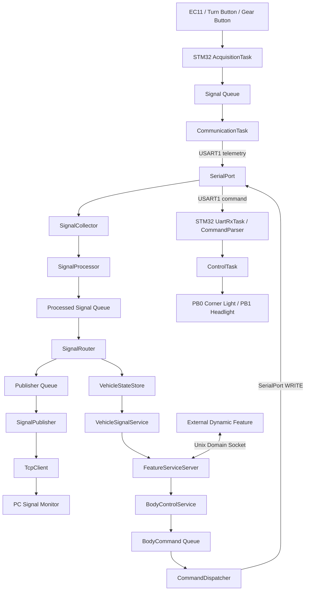
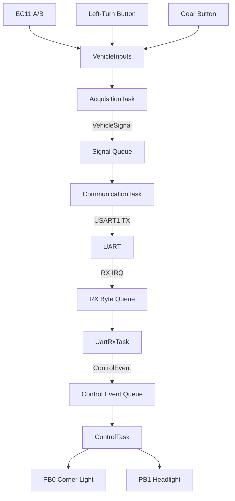

# Architecture

本文件展示 Vehicle Edge Gateway 当前完整架构与主要软件边界。

---

## 1. System Overview

```text
Physical Vehicle Inputs
EC11 / Left-Turn Button / Gear Button
        |
        v
STM32F103C8T6 + FreeRTOS
        |
        | UART telemetry / command
        v
i.MX6ULL
Vehicle Edge Gateway
        |
        +--> TCP --> PC Signal Monitor
        |
        `--> UDS <--> External Feature Process
```

STM32 负责 hardware-facing input acquisition、RTOS scheduling、UART endpoint 与 actuator execution；i.MX6ULL 负责 signal integration、state/service abstraction、network publishing 与 high-level Feature service boundary。

---

## 2. End-to-End Architecture



---

## 3. STM32 FreeRTOS Vehicle Node



Current physical input behavior:

```text
EC11 encoder
→ speed 0..120
→ +/-5 per detent

Left-turn button
→ toggle left_turn

Gear button
→ Forward +1 / Reverse -1
```

Input polling = 5 ms；button debounce ≈ 30 ms；vehicle-state publication = 100 ms。

---

## 4. Raw Signal → Semantic State

STM32 wire signal 保持简单：

```text
speed=20
gear=1
left_turn=1
```

Linux 通过 configurable source-to-path mapping 转换为：

```text
speed     → Vehicle.Speed
gear      → Vehicle.Powertrain.Transmission.SelectedGear
left_turn → Vehicle.Body.Lights.DirectionIndicator.Left.IsSignaling
```

这里使用 VSS-like semantic namespace，而不是完整 COVESA VSS implementation。

---

## 5. State and Routing Model

```text
SignalUpdate
= incoming event

VehicleStateStore
= latest known state

VehicleSignalService
= typed semantic API
```

`SignalRouter` 在更新 `VehicleStateStore` 的同时，把完整 signal stream 转发到独立 `publisher_queue`，使 Vehicle State 与 TCP publishing 可以同时消费同一数据流。

---

## 6. Derived Vehicle Feature

Feature A 使用多个车辆状态推导新的 vehicle behavior：

```text
Left-turn request
+
Vehicle speed
↓
Low-Speed Cornering Light Feature
↓
Corner Light
```

Feature 通过 Vehicle Service 获取 vehicle semantics，而不是直接读取内部 state map、UART 或 GPIO。

---

## 7. Vehicle Service Boundary

Feature 通过：

```text
get_speed()
get_gear()
get_left_turn()

set_corner_light()
set_headlight()
```

访问 vehicle semantics。

Feature 不直接依赖 `/dev/ttymxc5`、STM32 GPIO、UART wire format、HAL、FreeRTOS Queue 或 TcpClient。

---

## 8. Semantic Command → Hardware

```text
Feature decision
↓
BodyControlService
↓
BodyCommand
↓
CommandDispatcher
↓
UART wire command
↓
SerialPort::write_all()
↓
STM32 CommandParser
↓
ControlTask
↓
GPIO actuator
```

`BodyControlService` 描述 semantic action；`CommandDispatcher` 负责把它转换成当前 MCU transport 使用的 wire format。

---

## 9. Same-Process Full-Duplex UART

正式 `/dev/ttymxc5` 由 `vehicle-edge-gateway` 单一进程持有。

同一进程内部：

```text
SignalCollector   → SerialPort READ
CommandDispatcher → SerialPort WRITE
```

已完成持续 physical telemetry 上报期间同步 actuator command 的实机回归。

---

## 10. SOA / SDV-like Structure

```text
Hardware / Transport
        ↓
Vehicle State / Vehicle Service
        ↓
Independent Feature
        ↓
Semantic Control Service
        ↓
Hardware Adapter
```

Feature A 可以停止并替换为 Feature B，而 Gateway binary 与 STM32 firmware 保持不变，体现模块化 Feature development、runtime replaceability 与软硬件生命周期解耦。
